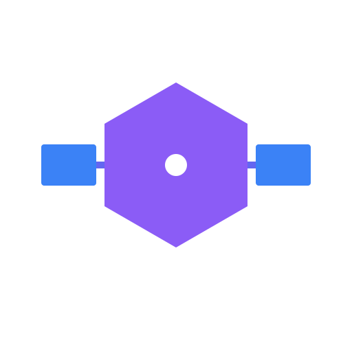

<div align="center">



# KodaJS

**The Hono-Native Meta-Framework for the Post-Web Era**

[](https://github.com/kodajs/koda)
[](https://bun.sh)
[](LICENSE)

[Documentation](https://kodajs.github.io) · [GitHub](https://github.com/kodajs/koda) · [Getting Started](#getting-started)

</div>

---

## About

This repository hosts the official documentation and landing page for **Koda Zenith** — the next-generation fullstack meta-framework built on [Hono](https://hono.dev) and optimized for [Bun](https://bun.sh).

Koda Zenith combines:
- **ElysiaJS ergonomics** — End-to-end type safety
- **Laravel/NestJS patterns** — Enterprise architecture
- **.koda & .zen DSL** — High-performance fullstack DSLs with Flutter-like DX for UI (.zen)
- **Astro-grade performance** — Island rendering, SSG/ISR
- **Future-ready design** — Web3, AI, AR/VR native support

## Development

```bash
# Install dependencies
bun install

# Start dev server
bun run dev

# Build for production
bun run build

# Preview production build
bun run preview
```

## Deployment

This site is automatically deployed to GitHub Pages via GitHub Actions on every push to `main`.

### Manual Deploy

```bash
bun run build
# Output in dist/ folder
```

## Tech Stack

- **[Astro](https://astro.build)** — Static site generator
- **[Tailwind CSS v4](https://tailwindcss.com)** — Styling
- **[Bun](https://bun.sh)** — Runtime & package manager

## Related

- **[Koda Zenith](https://github.com/kodajs/koda)** — The meta-framework
- **[Hono](https://hono.dev)** — Ultralight web framework
- **[Bun](https://bun.sh)** — JavaScript runtime

---

<div align="center">

**Building today for the immersive brutal future.**

© 2026 KodaJS

</div>
